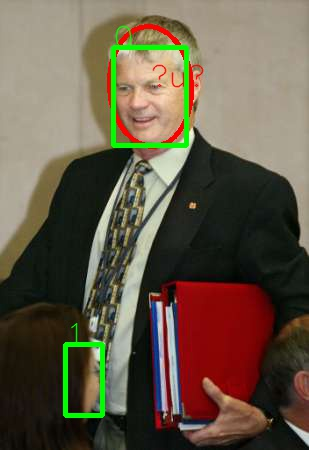
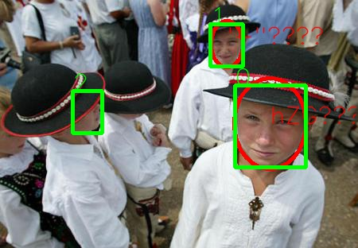
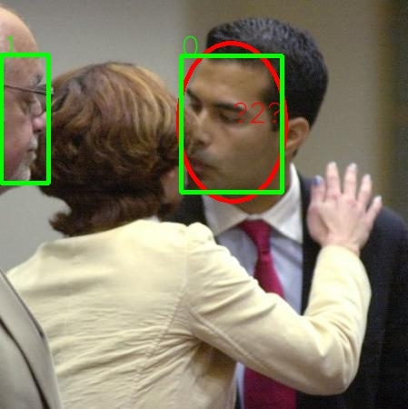

# Face-Detecion-with-the-Faster-R-CNN  or  R-FCN
The Faster-R-CNN code (written in Python) is available https://github.com/rbgirshick/py-faster-rcnn

If you find Faster R-CNN useful in your research, please consider citing:

    @inproceedings{renNIPS15fasterrcnn,
        Author = {Shaoqing Ren and Kaiming He and Ross Girshick and Jian Sun},
        Title = {Faster {R-CNN}: Towards Real-Time Object Detection
                 with Region Proposal Networks},
        Booktitle = {Advances in Neural Information Processing Systems ({NIPS})},
        Year = {2015}
    }
    
The R-FCN code (written in Python) is available https://github.com/Orpine/py-R-FCN

If you find R-FCN useful in your research, please consider citing:

    @article{dai16rfcn,
        Author = {Jifeng Dai, Yi Li, Kaiming He, Jian Sun},
        Title = {{R-FCN}: Object Detection via Region-based Fully Convolutional Networks},
        Journal = {arXiv preprint arXiv:1605.06409},
        Year = {2016}
    }

#### Some modification

1. Add lib/st_face.py for reading WIDER dataset, modified factory.py.
2. Add tools/demo4fddb.py for testing the model with FDDB dataset.
3. Modify tools/train_net.py. Set '--imdb'  default='st_face'.
4. Add prototxt to model

#### Installation

As the same as Faster-R-CNN and R-FCN

#### Trained models

exmaple models
http://pan.baidu.com/s/1kVI3IQj

#### Result on FDDB

#### Some "Mistakes"

red is ground-truth

